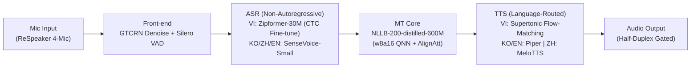

# AuraTranslate Edge — Offline NPU-Native Speech-to-Speech Translation Device

[](https://aihub.qualcomm.com)
[](docs/technical_proposal.docx)
[](docs/technical_proposal.docx)
[](#license--terms)

**AuraTranslate Edge** là thiết bị phiên dịch giọng nói hai chiều (Speech-to-Speech Translation) hoạt động **100% offline, NPU-native** trên nền tảng **Qualcomm Dragonwing IQ-9075 EVK** (SoC Qualcomm Hexagon NPU v73, lên tới 100 dense TOPS). Hệ thống kết nối chuỗi xử lý **Audio Front-end → ASR → MT → TTS** cho 4 ngôn ngữ: **Tiếng Việt (VI) ⇄ Tiếng Hàn (KO) / Tiếng Trung (ZH) / Tiếng Anh (EN)**, được thiết kế chuyên biệt cho môi trường công nghiệp có độ ồn cao (70–95 dB SPL) như các nhà máy FDI, công trường xây dựng, và trung tâm logistics tại Việt Nam.

Dự án được xây dựng bởi đội thi **Gia Sư Đỉnh Cao** cho cuộc thi **OneVoice AI Challenge 2026** (Saigon AI Hub × Qualcomm).

Tất cả các lựa chọn kiến trúc, mô hình và công thức lượng tử hoá trong kho mã nguồn này đều được đồng bộ chính xác theo **Technical Proposal (Phase 2 Technical Submission)** chính thức tại [`docs/technical_proposal.docx`](docs/technical_proposal.docx).

---

## 1. Điểm đột phá kỹ thuật cốt lõi (Key Technical Differentiators)

1. **100% Offline & NPU-Native (0.0% CPU Fallback):**
   - Thay vì chuyển đổi một ứng dụng điện thoại chạy ngốn pin trên CPU/GPU, AuraTranslate Edge được **đồng thiết kế (co-design) trực tiếp theo kiến trúc phần cứng NPU Qualcomm**: loại bỏ luồng điều khiển động, cố định kích thước tensor (static shapes), biên dịch thành các file nhị phân **QNN Context Binary (`.bin`)** chạy hoàn toàn trên Hexagon NPU.
   - Đã kiểm chứng thực nghiệm trên chip thật: **0.0% CPU fallback** ở các chặng đo kiểm.
2. **Công thức lượng tử hoá lai w8a16 (W8A16 Mixed Precision):**
   - Khắc phục triệt để hiện tượng vỡ âm, méo tiếng kim loại của chuẩn INT8 thông thường trên các bộ tổng hợp âm thanh (vocoder) và suy giảm thanh điệu tiếng Việt/tiếng Trung.
   - Trọng số 8-bit (INT8 weights) giúp tối ưu dung lượng bộ nhớ, trong khi kích hoạt 16-bit (INT16 activations) bảo toàn độ phân giải âm học và ngữ nghĩa ngôn ngữ.
   - **Đo kiểm độ chính xác trên phần cứng thật (Hardware-Verified vs FP32):**
     - **NLLB-200 Encoder:** Đạt **0.9998 cosine similarity** so với FP32 trên Dragonwing IQ-9075 EVK.
     - **Supertonic TTS Pipeline:** Đạt **1.000000 cosine similarity** so với FP32 trên Dragonwing IQ-9075 EVK.
3. **Độ trễ thời gian thực cấp độ phần cứng (Ultra-Low Latency):**
   - TTS pipeline đo thực tế trên phần cứng chỉ mất **15–20 ms** toàn chuỗi (riêng vocoder chỉ **7.397 ms**, RTF < 0.012).
   - Text-to-Speech Time-to-First-Byte (TTFB) < 40 ms; toàn bộ pipeline hướng tới độ trễ < 1.5s cho câu ngắn.
4. **Bảo mật tuyệt đối & Không chi phí định kỳ:**
   - Dữ liệu âm thanh được xử lý hoàn toàn trong bộ nhớ đệm (in-memory), không lưu trữ bền vững, không gửi dữ liệu ra máy chủ đám mây, tuân thủ nghiêm ngặt chính sách bảo mật IP của các nhà máy sản xuất.

---

## 2. Nền tảng phần cứng đã chọn (Hardware Platform Selection)

Dựa trên kết quả thực nghiệm tại **Section 5 (Hardware & Device Concept)** của Technical Proposal:

| Tiêu chí | Phương án A — Rubik Pi 3 (QCS6490)<br>*(Ứng viên ban đầu / Đã thay thế)* | Phương án B — Dragonwing IQ-9075 EVK<br>*(CHỌN CHÍNH THỨC / SELECTED)* |
|---|---|---|
| **Hiệu năng NPU** | 12 TOPS (Hexagon NPU thế hệ v68) | **100 dense TOPS** (Qualcomm Hexagon NPU thế hệ **v73**) |
| **Khả năng biên dịch w8a16** | ❌ **Không hỗ trợ** (Hexagon v68 không biên dịch được công thức w8a16 yêu cầu) | ✅ **Hỗ trợ đầy đủ & đã verify thành công 100%** qua Qualcomm QNN SDK |
| **Bộ nhớ RAM / Bộ nhớ trong** | 8 GB LPDDR4x + 128 GB UFS | **36 GB LPDDR5** + 128 GB UFS (dư dả cho pipeline đa mô hình) |
| **Công suất tiêu thụ (TDP)** | Cần nguồn 12V / 3A (36W) | SoC: **3.8 – 20 W**; Công suất toàn hệ thống: **~5.8 – 8.8 W** |
| **Thời lượng pin dự tính** | Yêu cầu nguồn ngoài, không có pin | Đạt **> 8 giờ hoạt động liên tục** với pin 6,000 mAh Li-Po |
| **Cảm biến âm thanh** | ReSpeaker 4-Mic Array | **ReSpeaker 4-Mic Array** (AC108 ADC, 4 micro MEMS analog, MVDR beamforming) |
| **Kết luận thẩm định** | **LOẠI BỎ / REPLACED** | **CHỌN CHÍNH THỨC (SELECTED)** |

> [!IMPORTANT]
> **Lý do thay đổi nền tảng phần cứng:** Nhóm ban đầu khảo sát Rubik Pi 3 (QCS6490) nhờ giá thành và kích thước nhỏ. Tuy nhiên, quá trình kiểm tra phần cứng cho thấy NPU Hexagon v68 của QCS6490 **không thể biên dịch được công thức lượng tử hoá lai w8a16**. Nhóm đã chính thức chuyển sang nền tảng **Dragonwing IQ-9075 EVK** với kiến trúc Hexagon v73+ hỗ trợ trọn vẹn w8a16, cung cấp tới 100 dense TOPS và 36 GB LPDDR5.

---

## 3. Kiến trúc AI & Bảng mô hình theo từng chặng (Module Pipeline)



### Bảng chi tiết thông số từng mô-đun (Section 4.2 Technical Proposal)

| Chặng | Mô-đun | Mô hình đã chọn | Kích thước / Tham số | Latency Target / Thực đo | Kỹ thuật cốt lõi & Tối ưu hoá NPU |
|:---:|---|---|---|---|---|
| **0** | **Audio Front-end** | **GTCRN** (ICASSP 2024) + **Silero VAD** | ~10 MB (~24K params GTCRN) | RTF < 0.1 (real-time) | Khử ồn máy móc nhà máy (70–95 dB SPL) thời gian thực + lọc bỏ khoảng lặng (silence gating), tránh lãng phí chu kỳ NPU |
| **1** | **ASR (Tiếng Việt)** | **Zipformer-30M (RNN-T → CTC Fine-tuned)** | **~85 MB** (21.4M params, FP16) | **Target < 300 ms** (Encoder Cosine Sim: 0.841, WER: 0.0615 w8a16) | Thay thế hoàn toàn decoder/joiner tuần tự bằng **1 CTC head đơn (single-shot non-autoregressive)**; fine-tune 3 giai đoạn trên **ViMD** (102.5h, 63 phương ngữ tỉnh thành); w8a16 QNN Context Binary |
| **1** | **ASR (Hàn / Trung / Anh)** | **SenseVoice-Small** (Alibaba FunASR) | **~250 MB** | **Target < 500 ms** | Kiến trúc non-autoregressive tự nhiên; tích hợp sẵn Language ID (LID) định tuyến tự động và chuẩn hoá văn bản ITN; w8a16 QNN Context Binary |
| **2** | **Dịch máy (MT)** | **NLLB-200-distilled-600M** (Meta AI) | **~600 MB** | **Target < 800 ms** (Encoder Cosine Sim: **0.9998** vs FP32 trên phần cứng thật) | Một mô hình duy nhất phủ trọn 6 chiều dịch (VI ⇄ KO, VI ⇄ ZH, VI ⇄ EN); w8a16 QNN Context Binary; tích hợp chính sách streaming **AlignAtt** (Interspeech 2023) phát từ sớm dựa trên ma trận attention |
| **3** | **TTS (Tiếng Việt)** | **Supertonic 3** (Flow-Matching) | **186.5 MB** (nén 50.9% so với FP32) | **Thực đo: 15–20 ms** toàn chuỗi; riêng vocoder: **7.397 ms** (RTF < 0.012) | **w8a16 QNN Context Binary**, unrolled static Flow-Matching ODE graph, **0.0% CPU fallback**; Cosine Sim = **1.000000**; tích hợp **Quality-Gated Retry** (tối đa 5 lần) chống lỗi lặp âm |
| **3** | **TTS (Hàn & Anh)** | **Piper** (VITS-based) | ~60–80 MB / giọng | Target < 300 ms | One-shot VITS decoder, w8a16 QNN Context Binary |
| **3** | **TTS (Tiếng Trung)** | **MeloTTS** | ~50–150 MB | Target < 300 ms | Pre-quantized HTP NPU trên Qualcomm AI Hub, w8a16 QNN Context Binary |

---

## 4. Ngân sách tài nguyên & Quản lý bộ nhớ (Memory & Power Budget)

- **Tổng dung lượng mô hình trên ổ đĩa (128 GB UFS):** Toàn bộ pipeline lượng tử hoá w8a16 chiếm khoảng **~1.3 GB**, tải tức thì lúc khởi động dưới dạng QNN Context Binaries.
- **Mức chiếm dụng RAM NPU (36 GB LPDDR5):**
  - Đỉnh RAM hoạt động của chặng TTS đo thực tế trên phần cứng: **< 180 MB**.
  - Headroom bộ nhớ cực kỳ dồi dào trên Dragonwing IQ-9075 EVK, loại bỏ nguy cơ tràn RAM (OOM) khi chạy đồng thời nhiều mô hình.
  - Cơ chế **Lazy Loading** và giải phóng định kỳ bộ đệm ngữ cảnh (past-context flushing) chống rò rỉ bộ nhớ trong các phiên làm việc kéo dài trọn ca sản xuất (> 8 tiếng).
- **Tổng công suất tiêu thụ toàn hệ thống:** **~5.8 – 8.8 W** (Bao gồm SoC 3.8–20W, ReSpeaker Mic 0.1W, Loa 0.5W, UFS Storage 0.2W), vận hành êm ái với tản nhiệt thụ động (fanless passive cooling).

---

## 5. Xử lý thách thức môi trường biên (Robustness & Edge Cases)

1. **Chống nhiễu công nghiệp (Acoustic Noise 70–95 dB SPL):** Chặng tiền xử lý GTCRN triệt tiêu tạp âm máy móc trước khi đưa vào ASR, kết hợp tăng cường dữ liệu nhiễu trong tập huấn luyện của Zipformer.
2. **Loại bỏ vòng lặp vọng âm (Echo Prevention):** Cơ chế giao tiếp bán song công (half-duplex turn-based): tự động ngắt micro (mute) trong lúc loa TTS đang phát âm thanh phiên dịch, ngăn thiết bị tự nhận diện tiếng của chính mình mà không cần thuật toán AEC phức tạp.
3. **Thích ứng 63 phương ngữ Việt Nam:** Mô hình Zipformer-30M được tinh chỉnh trên tập dữ liệu **ViMD (EMNLP 2024)** gồm hơn 102 giờ nói chuẩn từ 63 tỉnh thành (Bắc, Trung, Nam) giúp xoá bỏ điểm yếu nhận diện giọng địa phương.
4. **Chống lỗi lặp âm Flow-Matching (Quality-Gated Retry):** Tích hợp vòng lặp kiểm định tức thì: audio tiếng Việt sinh ra từ Supertonic được SenseVoice ASR nhận diện ngược lại (round-trip verification) để kiểm tra độ trùng khớp trước khi phát ra loa; tự động tái sinh tối đa 5 lần nếu phát hiện lỗi lặp âm.

---

## 6. Cấu trúc thư mục kho mã nguồn (Repository Layout)

```
├── README.md                      # Tài liệu tổng quan dự án (đồng bộ với Technical Proposal)
├── requirements.txt               # Thư viện phụ thuộc cho toàn dự án
├── docs/                          # Tài liệu kỹ thuật chuyên sâu
│   ├── technical_proposal.docx    # Bản đệ trình chính thức Phase 2 (Gia Su Dinh Cao - AuraTranslate Edge)
│   ├── step0.md                   # Báo cáo chi tiết Audio Front-end (GTCRN, VAD, Beamforming)
│   ├── step1.md                   # Báo cáo chi tiết ASR (Zipformer-30M CTC, SenseVoice-Small w8a16)
│   ├── step2.md                   # Báo cáo chi tiết MT (NLLB-200, AlignAtt)
│   ├── step3.md                   # Báo cáo chi tiết TTS (Supertonic w8a16, Piper, MeloTTS)
│   └── step4.md                   # Báo cáo chi tiết Phần cứng & Lượng tử hoá NPU
├── src/
│   ├── common.py                  # Các hàm tiện ích dùng chung (đo RTF, I/O WAV, WER/CER)
│   ├── step0_frontend/            # Mã nguồn tiền xử lý âm thanh: GTCRN denoiser, VAD, beamforming
│   ├── step1_asr/                 # Mã nguồn ASR & Pipeline lượng tử hóa NPU
│   │   ├── unified_asr.py         # Router định tuyến ASR tự động đa ngôn ngữ
│   │   ├── step4_s1_export_e2e_onnx.py    # Xuất đồ thị SenseVoice E2E ONNX tĩnh
│   │   ├── step4_s1_patch_mask.py         # Vá lỗi zero-bias 70 Conv nodes bằng GraphSurgeon cho QAIRT
│   │   ├── step4_s1_prepare_calib.py      # Chuẩn bị dữ liệu calibration cho w8a16
│   │   ├── step4_s1_qai_hub_submit_e2e.py # Gửi biên dịch QNN DLC lên Qualcomm AI Hub
│   │   └── step4_s1_profile_e2e.py        # Đo latency và RAM thực tế trên Hexagon NPU
│   ├── step2_mt/                  # Mã nguồn dịch máy NLLB-600M INT8 & AlignAtt
│   ├── step3_tts/                 # Mã nguồn TTS (Supertonic mixed w8a16, Piper, MeloTTS)
│   │   ├── quantize_supertonic.py         # Script lượng tử hoá lai cho Supertonic
│   │   └── diagnose_supertonic_int8.py    # Script bisection xác định nguyên nhân vỡ âm
│   └── step5_pipeline/            # Pipeline kết nối toàn chuỗi ASR → MT → TTS
│       └── pipeline_s2s.py        # Script chạy chuỗi hoàn chỉnh trên CPU/GPU
├── third_party_gtcrn/             # Checkpoint & mã nguồn gốc GTCRN (MIT License)
├── third_party_zipformer/         # Checkpoint & runtime sherpa-onnx cho Zipformer-30M
├── data/                          # Thư mục chứa dữ liệu âm thanh kiểm thử (gitignored)
└── outputs/                       # Thư mục xuất kết quả CSV, mô hình QNN và file WAV kiểm thử
```

---

## 7. Hướng dẫn cài đặt & Chạy kiểm thử (Quick Start)

### 7.1. Cài đặt môi trường

Khuyến nghị sử dụng môi trường Python 3.10 hoặc 3.11:

```bash
git clone https://github.com/Khanhhh239/OneVoice.git
cd OneVoice
pip install -r requirements.txt
```

### 7.2. Chạy kiểm thử từng mô-đun độc lập

```bash
# 1. Step 0: Audio Front-end (Khử ồn GTCRN + VAD + Beamforming)
cd src/step0_frontend && python run_all.py

# 2. Step 1: ASR Pipeline (Kiểm tra định tuyến Zipformer + SenseVoice)
cd ../step1_asr && python test_unified_asr.py

# 3. Step 2: Dịch máy (NLLB-200 trên FLORES-200)
cd ../step2_mt && python test_mt_nllb.py

# 4. Step 3: Tổng hợp giọng nói tiếng Việt (Supertonic / Piper)
cd ../step3_tts && python test_tts_supertonic.py
```

### 7.3. Chạy Pipeline hoàn chỉnh Speech-to-Speech

```bash
cd src/step5_pipeline
python pipeline_s2s.py --device cpu
# Hoặc trên GPU trạm phát triển:
python pipeline_s2s.py --device cuda
```

---

## 8. Đội ngũ phát triển (Team Profile — Gia Sư Đỉnh Cao)

| Thành viên | Vai trò | Chuyên môn | Phạm vi đóng góp chính |
|---|---|---|---|
| **Trần Quốc Khánh** | **Team Lead** | Project Manager, Model Optimisation | Triển khai Dịch máy (MT) + Triển khai ASR tiếng Việt + Tích hợp Pipeline toàn chuỗi + Rà soát hệ thống |
| **Lê Gia Khánh** | **AI Engineer** | UI/UX, User Research | Triển khai ASR (Trung / Hàn / Anh) + Xây dựng Bài toán thực tế & Phân tích đối tượng người dùng |
| **Phạm Chấn Khoa** | **AI Engineer** | Business Analyst, Model Quantization | Triển khai TTS (Hàn / Anh) + Thu thập dữ liệu + Xây dựng giải pháp kinh doanh (Business Solution) |
| **Cái Hoàng Bảo Kin** | **AI Engineer** | NLP, MT Evaluation | Khảo sát & Đánh giá mô hình Dịch máy + Thiết kế chính sách Streaming MT + Thiết kế kiến trúc AI |
| **Trần Trung Hiếu** | **AI Engineer** | Edge AI Optimisation, System Architecture | Triển khai TTS (Trung) + Lượng tử hoá phần cứng NPU + Thiết kế kiến trúc hệ thống tổng thể |

---

## 9. Giấy phép & Điều khoản (License & Terms)

- Toàn bộ mã nguồn do nhóm phát triển được phát hành theo giấy phép **MIT License**.
- Các mô hình thành phần tuân thủ giấy phép gốc tương ứng:
  - **GTCRN**: MIT License (vendored tại `third_party_gtcrn/`).
  - **Silero VAD**: MIT License.
  - **Zipformer-30M-RNNT**: CC-BY-NC-ND-4.0 (sử dụng trong khuôn khổ nghiên cứu học thuật cuộc thi).
  - **ViMD Dataset**: Giấy phép nghiên cứu học thuật EMNLP 2024.
  - **SenseVoice-Small**: Apache 2.0.
  - **NLLB-200**: CC-BY-NC-4.0.
  - **Supertonic 3**: Code MIT / Weights OpenRAIL-M.
  - **Piper TTS**: MIT License.
  - **MeloTTS**: MIT License.
