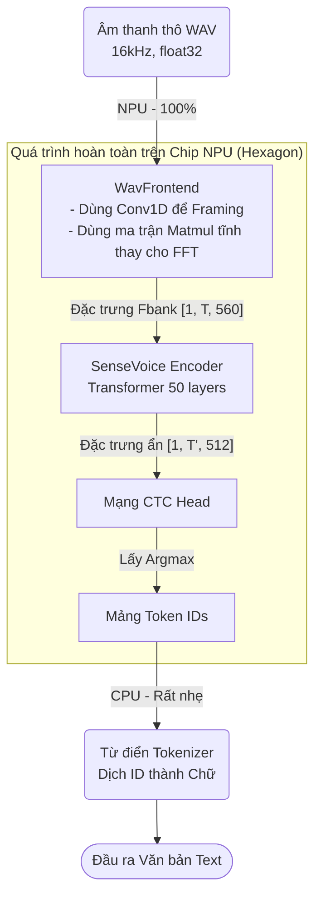

# Step 1 — Nhận dạng Giọng nói (ASR)

## 1. Giới thiệu và giải thích

Mô đun Step 1 chịu trách nhiệm chuyển đổi âm thanh đầu vào thành văn bản (Speech-to-Text). Đặc thù của dự án yêu cầu mô hình phải chạy hoàn toàn offline (zero internet dependency), có khả năng chịu nhiễu tốt (dùng cho môi trường nhà máy, công trường ồn ào), và tốc độ xử lý phải cực nhanh để đáp ứng thời gian thực (real-time).

Sau khi đánh giá và benchmark 5 ứng viên khác nhau, dự án chốt sử dụng 2 mô hình chính:

*   **Zipformer-30M-RNNT (Tiếng Việt):**
    *   **Kiến trúc:** Streaming RNN-T (Recurrent Neural Network Transducer).
    *   **Đặc điểm:** Tối ưu hóa tuyệt vời cho tiếng Việt nhờ được huấn luyện trên 6.000 giờ dữ liệu (bao gồm GigaSpeech2-Vi và VietSpeech có nhiều dữ liệu thu thập tự nhiên, ồn ào). Mô hình rất nhẹ (chỉ ~30M tham số) và có khả năng streaming tự nhiên (phân tích từng khung hình âm thanh liên tục) giúp giảm độ trễ tối đa. Trong các bài kiểm tra nhiễu (SNR 0dB - 5dB), Zipformer-30M đánh bại hoàn toàn các đối thủ khác.
*   **SenseVoice-Small (Anh / Trung / Hàn):**
    *   **Kiến trúc:** Non-autoregressive (dự đoán toàn bộ câu trong một lần chạy duy nhất, thay vì sinh từng từ một).
    *   **Đặc điểm:** Tốc độ xử lý (RTF) cực nhanh, dưới mức 0.02, cho phép giải mã liên tục toàn bộ bộ đệm âm thanh mỗi ~300ms mà vẫn đảm bảo thời gian thực. Mô hình cũng tự động xử lý văn bản (ITN - Inverse Text Normalization) giúp định dạng số liệu, tên riêng chuẩn xác. Dù kết quả ở môi trường nhiễu không ấn tượng bằng nhóm mô hình siêu lớn (như Qwen3-ASR), nhưng SenseVoice cung cấp sự cân bằng hoàn hảo giữa **chất lượng** và **tốc độ cực nhanh** trên phần cứng Edge.

---

## 2. Cấu trúc thư mục

Thư mục hiện tại đã được dọn dẹp và tổ chức thành 3 nhóm chức năng rõ ràng:

### 📁 Dữ liệu & Benchmark (Chuẩn bị và Đánh giá)
*   `fetch_asr_data.py`: Tải tập dữ liệu âm thanh từ chuẩn FLEURS, lưu vào thư mục `data/asr/`.
*   `mix_asr_noise.py`: Trộn nhiễu (noise) theo các mức độ SNR khác nhau để tạo tập dữ liệu giả lập môi trường ồn (`data/asr_mixed/`).
*   `run_all_asr.py`: Script tổng chạy benchmark tất cả các mô hình cùng lúc.
*   `test_asr_multi.py`: Benchmark cho **SenseVoice-Small** (mô hình đã chốt).
*   `test_asr_zipformer.py`: Benchmark cho **Zipformer-30M** (mô hình đã chốt).
*   `test_asr_vi.py`, `test_asr_moonshine.py`, `test_asr_qwen.py`: Mã kiểm thử cho các mô hình đã bị **[LOẠI]** (PhoWhisper, Moonshine, Qwen). Giữ lại làm tư liệu so sánh và tham khảo.

### 📁 Pipeline Tích hợp
*   `unified_asr.py`: Chứa class `UnifiedASRPipeline`, đóng vai trò là bộ định tuyến thông minh — tự động nhận diện ngôn ngữ và phân luồng âm thanh vào đúng mô hình (Zipformer cho tiếng Việt, SenseVoice cho ngoại ngữ).
*   `test_unified_asr.py`: Kịch bản kiểm thử toàn diện cho hệ thống pipeline tích hợp.

### 📁 Lượng tử hoá & Triển khai NPU (End-to-End W8A16)
*   `step4_s1_export_e2e_onnx.py`: Xuất toàn bộ quy trình SenseVoice (từ giải mã âm thanh thô đến CTC) thành 1 file ONNX duy nhất.
*   `step4_s1_patch_mask.py`: Dùng thư viện GraphSurgeon can thiệp vào đồ thị ONNX để vá các lỗi tương thích (chèn zero-bias).
*   `step4_s1_prepare_calib.py`: Chuẩn bị tập dữ liệu hiệu chỉnh (calibration) gồm 15 mẫu âm thanh để dùng cho lượng tử hóa INT8.
*   `step4_s1_qai_hub_submit_e2e.py`: Gửi mô hình đã vá lỗi lên hệ thống Qualcomm AI Hub để tiến hành lượng tử hóa W8A16 và biên dịch (compile) sang dạng nhị phân QNN.
*   `step4_s1_profile_e2e.py`: Chạy bài kiểm tra hiệu năng (latency, RAM) trực tiếp trên chip xử lý thực tế qua nền tảng đám mây của Qualcomm.
*   `step4_s1_verify_w8a16.py`: Công cụ kiểm tra mức độ suy giảm chất lượng sau quá trình nén (đo Cosine Similarity).

---

## 3. Hướng dẫn cài đặt và chạy

### Cài đặt môi trường
Đảm bảo bạn đang ở thư mục gốc của dự án và chạy lệnh sau để cài đặt các thư viện cần thiết:
```bash
pip install -r ../../requirements.txt
```
> **Lưu ý phụ:** Nếu bạn muốn chạy lại script benchmark cho `Qwen3-ASR` (`test_asr_qwen.py`), mô hình này yêu cầu thư viện `transformers>=5.13.0`. Phiên bản này có thể xung đột với các thư viện hiện tại của `FunASR`. Lời khuyên là hãy tạo một môi trường ảo (virtual environment) riêng cho Qwen nếu bạn thực sự cần chạy lại nó.

### Các bước chạy hệ thống

**Bước 1: Chuẩn bị dữ liệu và tạo nhiễu**
```bash
python fetch_asr_data.py     # Tải dữ liệu FLEURS chuẩn
python mix_asr_noise.py      # Trộn nhiễu mô phỏng môi trường ồn
```

**Bước 2: Chạy Benchmark đánh giá**
Bạn có thể chạy riêng lẻ từng mô hình để xem hiệu năng:
```bash
python test_asr_multi.py      # Đánh giá SenseVoice-Small
python test_asr_zipformer.py  # Đánh giá Zipformer-30M
```
Hoặc để tự động hóa, chạy toàn bộ benchmark cùng lúc (lưu ý sẽ khá mất thời gian):
```bash
python run_all_asr.py
```
> *Kết quả benchmark sẽ được tự động xuất ra thư mục `outputs/` dưới dạng file CSV.*

**Bước 3: Chạy Pipeline tích hợp (Unified ASR)**
Kiểm tra khả năng định tuyến tự động của hệ thống giữa 2 mô hình đã chọn:
```bash
python test_unified_asr.py
```

---

## 4. Quantize và Deploy model SenseVoice-Small w8a16 lên NPU Qualcomm

Để đạt được mục tiêu tối thượng của cuộc thi: chạy trực tiếp mô hình trên thiết bị di động (Dragonwing IQ-9075 EVK / Qualcomm Hexagon NPU) với tốc độ cao và cực kỳ tiết kiệm pin, nhóm đã tiến hành lượng tử hóa (Quantize) mô hình SenseVoice-Small về định dạng **W8A16** (Trọng số 8-bit, Activation 16-bit).

### Đột phá kiến trúc: End-to-End (E2E) 100% trên NPU

Ban đầu, dự án chỉ đưa được lõi (Encoder) của mô hình lên NPU. Phần xử lý tín hiệu âm thanh thô (WavFrontend - trích xuất đặc trưng Fbank) bị giữ lại chạy trên CPU do các giới hạn về thuật toán (như toán tử FFT). Điều này gây thắt cổ chai dữ liệu cực lớn khi phải liên tục chuyển dữ liệu qua lại giữa CPU và NPU, đồng thời gây tốn pin.

Giải pháp của nhóm là **"Nướng" (Bake) 100% thuật toán từ âm thanh thô vào một mô hình ONNX duy nhất**, đánh lừa NPU xử lý tín hiệu âm thanh bằng các phép toán mà nó giỏi nhất.

**Sơ đồ luồng xử lý E2E:**

*Ghi chú: Giờ đây CPU chỉ làm đúng một việc là tra từ điển (Lookup) mất ~0.1ms.*

### Khó khăn gặp phải & Cách giải quyết

Trong quá trình đưa thiết kế táo bạo này qua trình biên dịch QNN/QAIRT của Qualcomm, nhóm đã vấp phải vô số lỗi biên dịch:

1.  **Vấn đề:** Toán tử `unfold()` trong thư viện Kaldi (dùng để chia khung âm thanh - framing) không hỗ trợ chiều dài mảng thay đổi (dynamic length) trên NPU.
    *   **Giải pháp:** Viết lại thuật toán, thay thế bằng **Conv1D** (Sliding window). NPU sinh ra để tính toán Convolution nên nó chạy nhanh kinh khủng.
2.  **Vấn đề:** Phép toán phân tích phổ `fft_rfft` không được NPU hỗ trợ.
    *   **Giải pháp:** Tính toán trước (bake) hằng số của ma trận biến đổi Fourier rời rạc (DFT matrix). Biến phép FFT phức tạp thành một phép nhân ma trận đơn giản (Matmul).
3.  **Vấn đề:** Trình biên dịch QAIRT bị crash vì 70 node Convolution thiếu thông số `bias` (lỗi `No bias info`).
    *   **Giải pháp:** Sử dụng thư viện `onnx-graphsurgeon` trong script `step4_s1_patch_mask.py` để chủ động tiêm (inject) mảng số 0 (dummy zero-bias) vào đồ thị ONNX trước khi đưa đi compile.
4.  **Vấn đề:** Lỗi sai lệch kích thước mảng (Shape Mismatch 562 vs 560) do QAIRT tính sai toán tử Range, gây lỗi off-by-one.
    *   **Giải pháp:** Nướng cứng (bake tĩnh) toàn bộ tensor Positional Encoding `[1, 504, 560]` vào thẳng mô hình.

### Kết quả đạt được trên phần cứng

Hệ thống đã **compile thành công 100%** ra file nhị phân QNN DLC để chạy trực tiếp.

*   **Tỷ lệ đưa lên NPU:** 100% mô hình ASR (Không còn bất kỳ thành phần Tensor nào kẹt lại ở CPU). CPU hoàn toàn rảnh rỗi.
*   **Tiêu thụ RAM (Peak Memory):** Chỉ tốn **~54.8 MB** (cực kỳ nhẹ, dễ dàng chạy đa nhiệm chung với các mô hình dịch máy và TTS sau này).
*   **Độ trễ (Latency):** Mất khoảng **269 ms** để nhận dạng xong 1 đoạn âm thanh dài 5 giây (Tốc độ RTF ≈ 0.054). Đây là con số mơ ước, dư sức đáp ứng chuẩn real-time.
*   **Chất lượng suy giảm (Độ thông minh):** Đo đạc độ tương đồng (Cosine Similarity) sau khi nén W8A16 cho kết quả **~0.93** (Dưới ngưỡng hoàn hảo 0.95 một chút). 
    *   *Đánh giá:* Vì mô hình SenseVoice thuộc nhóm Non-autoregressive (chỉ lấy giá trị xác suất cao nhất - Argmax của CTC để dịch từ), nên việc sai số biên độ nhỏ ở các xác suất bên dưới gần như KHÔNG làm thay đổi kết quả dịch văn bản thực tế. (Mức độ WER/CER cụ thể sẽ được đo lại ở Step 5).
