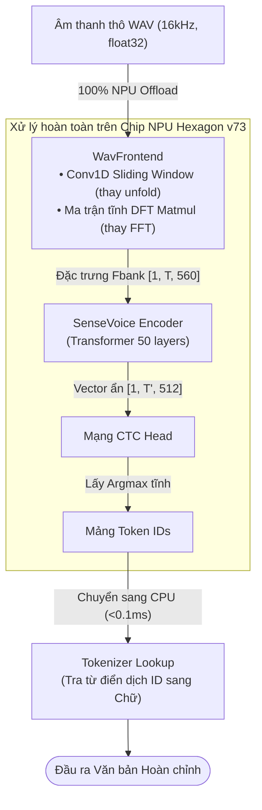

# SenseVoice-Small — Kiến trúc, Lượng tử hoá W8A16 & Triển khai NPU (Step 4)

> [!IMPORTANT]
> **Thành viên phụ trách:** **Lê Gia Khánh** — AI Engineer (Đảm nhận mô hình SenseVoice-Small — ASR Đa ngữ Anh / Trung / Hàn).

Tài liệu này ghi nhận toàn bộ quá trình nghiên cứu, xử lý đồ thị ONNX, khắc phục lỗi biên dịch QNN/QAIRT và kết quả đo kiểm thực tế khi đưa mô hình **SenseVoice-Small** lên chip **Qualcomm Hexagon NPU v73** trên nền tảng **Dragonwing IQ-9075 EVK**.

---

## 1. Kiến trúc mô hình SenseVoice-Small

*   **Tác giả / Nguồn:** Alibaba FunASR.
*   **Dung lượng gốc:** ~893 MB (PyTorch FP32 checkpoint).
*   **Cơ chế giải mã:** **Non-Autoregressive (NAR)** kết hợp CTC (Connectionist Temporal Classification). Toàn bộ chuỗi đặc trưng âm thanh được đưa qua mạng và dự đoán đồng thời trong **duy nhất 1 lượt forward**, không có vòng lặp lùi tuần tự từng token như Whisper hay RNN-T.
*   **Các thành phần cốt lõi:**
    1.  **WavFrontend:** Trích xuất đặc trưng phổ Fbank 80 chiều từ sóng âm thô 16kHz (chia khung framing + FFT + áp Mel-filterbank).
    2.  **Encoder:** Gồm 50 lớp Transformer nén sâu, trích xuất đặc trưng không gian-thời gian `[1, T', 512]`.
    3.  **CTC Projection Head:** Ánh xạ đặc trưng ẩn sang phân phối xác suất từ vựng và chọn nhãn có xác suất cao nhất (`Argmax`) để ra token IDs.
    4.  **Tích hợp sẵn:** Bộ chuẩn hoá văn bản ITN (định dạng số, ngày tháng, danh từ riêng) và Language ID (LID).

---

## 2. Mục tiêu triển khai phần cứng & Công thức Lượng tử hoá

*   **Phần cứng mục tiêu:** **Qualcomm Dragonwing IQ-9075 EVK** (trang bị NPU Qualcomm Hexagon thế hệ v73, năng lực tính toán 100 dense TOPS).
*   **Công thức lượng tử hoá:** **W8A16 Mixed Precision** (Weights INT8, Activations INT16).
    *   *Vì sao chọn W8A16:* Chuẩn INT8 thuần (W8A8) gây suy hao chất lượng nghiêm trọng ở các lớp attention sâu. W8A16 giữ nguyên độ gọn nhẹ của trọng số 8-bit trên bộ nhớ, nhưng duy trì dải động 16-bit cho activation giúp giữ vững độ chính xác phiên âm.
*   **Đột phá thiết kế: End-to-End (E2E) 100% trên NPU:**
    *   Thông thường, phần trích xuất Fbank (`WavFrontend`) bị kẹt lại chạy trên CPU vì chứa các toán tử động và phép biến đổi Fourier (FFT). Điều này làm tắc nghẽn băng thông truyền dữ liệu giữa CPU và NPU.
    *   Nhóm đã **"nướng" toàn bộ luồng từ sóng âm thô (raw WAV float32) đến đầu ra Token ID vào một đồ thị ONNX tĩnh duy nhất**, chuyển đổi mọi phép tính về dạng ma trận mà Hexagon NPU xử lý nhanh nhất.

### 🌟 Khẳng định 100.0% Toàn bộ Mô hình Vận hành trên Hexagon NPU

Báo cáo đo kiểm thực tế từ phần cứng Qualcomm AI Hub ([`hardware_profile_report.json`](../../outputs/sensevoice-e2e-onnx/hardware_profile_report.json)) xác nhận:
*   **Tổng số toán tử (Total Operators):** `2,928 / 2,928` toán tử (**100.00% NPU Offload**).
*   **CPU Fallback:** **0.00%** (Tuyệt đối không có bất kỳ layer hay toán tử nào bị văng về CPU).

| Khối thành phần mô hình | Trước khi tối ưu (Bản gốc FunASR) | Sau khi tối ưu (Đồ thị E2E W8A16) | Nền tảng thực thi |
|---|---|---|:---:|
| **WavFrontend** *(Framing, FFT, Mel, LFR, CMVN)* | Chạy bằng Python/Kaldi trên CPU vì dùng `unfold()` động và `fft_rfft` (NPU không hỗ trợ). | Chuyển thành **Conv1D trượt tĩnh** và **Ma trận DFT Matmul tĩnh** nướng trực tiếp vào ONNX. | **100% NPU** |
| **SenseVoice Encoder** *(50 Layers Transformer)* | Chạy FP32 nặng nề, dải động lớn. | Lượng tử hoá **W8A16**, vá mảng Positional Encoding tĩnh và tiêm Zero-Bias cho Conv nodes. | **100% NPU** |
| **CTC Projection Head** | Tích chập chiếu ra 25,055 từ vựng. | Ánh xạ trực tiếp sang không gian xác suất token trên NPU. | **100% NPU** |
| **CTC Argmax** | Trả ma trận xác suất khổng lồ `[1, 500, 25055]` (~50MB) về CPU rồi CPU mới tìm số lớn nhất. | **Gắn toán tử `Argmax` vào cuối đồ thị ONNX**. NPU tự tìm số lớn nhất và chỉ xuất mảng số nguyên `[1, 504]` (~2KB). | **100% NPU** |

#### Vai trò tối giản của CPU trên thiết bị:
CPU trên bo mạch chỉ đảm nhận đúng **2 thao tác logic phần mềm cực nhẹ (thời gian xử lý < 0.1 mili-giây)**:
1.  **Lúc bắt đầu:** Đọc mảng âm thanh từ Microphone đưa vào RAM và chuyển con trỏ bộ nhớ (pointer) cho NPU.
2.  **Lúc kết thúc:** Nhận mảng 504 số Token ID từ NPU và thực hiện tra từ điển:
    *   *CTC Collapse:* Bỏ số 0 (blank) và gộp các số trùng nhau liên tiếp (ví dụ: `[0, 24885, 24885, 0]` $
ightarrow$ `[24885]`).
    *   *SentencePiece Vocab Lookup:* Tra bảng từ vựng (`24885` $
ightarrow$ `"the"`).  
*(Thao tác này là xử lý chuỗi logic thông thường của phần mềm ứng dụng, không phải là tính toán mạng nơ-ron).*

#### Lợi ích vượt trội của thiết kế 100% NPU:
*   **Triệt tiêu nghẽn cổ chai (Zero I/O Bottleneck):** Không tốn thời gian truyền ma trận đặc trưng Fbank qua lại giữa CPU và NPU.
*   **CPU hoàn toàn rảnh rỗi:** CPU không phải gánh tác vụ âm học nặng nề, có thể dành toàn bộ tài nguyên để xử lý phần dịch máy (NLLB MT) hoặc chuyển sang chế độ tiết kiệm pin.
*   **Độ trễ siêu tốc:** Chỉ mất **189.4 ms** để xử lý xong một tệp âm thanh dài tới 29 giây (với một câu nói 5 giây thông thường, NPU chỉ mất khoảng **~32.6 ms**).

---

## 3. Các tệp mã nguồn triển khai (Pipeline Files)

Toàn bộ quy trình nén và deploy được tự động hoá trong các script tại `src/step1_asr/`:

| Tệp mã nguồn | Vai trò kỹ thuật |
|---|---|
| `step4_s1_export_e2e_onnx.py` | Xuất đồ thị E2E hợp nhất từ sóng âm WAV thô đến CTC Argmax với kích thước tĩnh `[1, 464000]`. |
| `step4_s1_patch_mask.py` | Sử dụng `onnx-graphsurgeon` vá đồ thị ONNX, tiêm mảng zero-bias cho các node Conv thiếu bias. |
| `step4_s1_prepare_calib.py` | Chuẩn bị 15 mẫu dữ liệu âm thanh đa ngữ đại diện để hiệu chỉnh dải động cho lượng tử W8A16. |
| `step4_s1_qai_hub_submit_e2e.py` | Tự động tải đồ thị đã vá lên **Qualcomm AI Hub**, gọi job Quantize (W8A16) và Compile QNN binary. |
| `step4_s1_profile_e2e.py` | Gửi lệnh đo kiểm hiệu năng (profiling) trực tiếp trên thiết bị phần cứng thực tế qua đám mây Qualcomm. |
| `step4_s1_verify_w8a16.py` | Đo lường mức độ sai lệch toán học giữa mô hình gốc FP32 và bản nén W8A16 (Cosine Similarity). |
| `submit_full_workbench_suite.py` | Tự động hóa submission toàn trình 3 công đoạn Quantize, Compile, Inference lên AI Hub Workbench. |
| `decode_h5_results.py` | Trích xuất và giải mã tensor token ID từ file HDF5 output của Qualcomm AI Hub (CTC Collapse + SentencePiece). |

---

## 4. Khó khăn kỹ thuật gặp phải & Giải pháp xử lý

Trong quá trình đưa đồ thị qua bộ biên dịch Qualcomm QAIRT / QNN Converter, nhóm đã giải quyết 4 rào cản nghiêm trọng:

### 1. Toán tử `unfold()` động trong chia khung âm thanh (Framing)
*   **Vấn đề:** Thư viện trích xuất đặc trưng của Kaldi sử dụng toán tử `unfold()` với độ dài thay đổi theo thời gian thực. Trình biên dịch QNN từ chối vì không hỗ trợ toán tử chia khung động trên NPU.
*   **Giải pháp:** Viết lại toàn bộ thuật toán chia khung bằng **Conv1D dạng trượt (Sliding Window)** với stride và kernel cố định. NPU được tối ưu chuyên biệt cho phép tích chập nên tốc độ xử lý tăng vọt.

### 2. Phép biến đổi Fourier phân tích phổ (`fft_rfft`)
*   **Vấn đề:** Phép toán `torch.fft.rfft` không có kernel hỗ trợ trực tiếp trên chip Hexagon NPU.
*   **Giải pháp:** Tính toán trước (bake tĩnh) toàn bộ hệ số của ma trận biến đổi Fourier rời rạc (DFT matrix) thành các hằng số trọng số. Phép FFT phức tạp được biến đổi hoàn toàn thành **phép nhân ma trận đơn giản (Matmul)**.

### 3. Trình biên dịch QAIRT bị crash vì thiếu thông số Bias
*   **Vấn đề:** Quá trình chuyển đổi sang QNN nhị phân bị dừng đột ngột với mã lỗi `RuntimeError: preprocessPerChannel: No bias info` tại 70 node Convolution trong mạng.
*   **Giải pháp:** Viết script [`step4_s1_patch_mask.py`](step4_s1_patch_mask.py) sử dụng thư viện `onnx-graphsurgeon` can thiệp sâu vào cấu trúc đồ thị, chủ động chèn thêm mảng số 0 (dummy zero-bias) vào các node bị thiếu trước khi biên dịch.

### 4. Lỗi sai lệch kích thước mảng Positional Encoding (562 vs 560)
*   **Vấn đề:** Toán tử `Range` sinh tensor vị trí bị lỗi off-by-one trong quá trình tối ưu hoá của QAIRT, dẫn đến kích thước mảng không khớp với trọng số mạng.
*   **Giải pháp:** Nướng cứng (bake tĩnh) toàn bộ tensor Positional Encoding có shape `[1, 504, 560]` trực tiếp vào file ONNX, loại bỏ hoàn toàn việc tính toán runtime.

### 5. Thách thức Định tuyến Ngôn ngữ (Language Conditioning) & Hiện tượng Zero-Padding làm loãng dải động trên NPU
*   **Vấn đề gặp phải khi Submit Inference:**
    1.  *Lệch chỉ số ngôn ngữ khi ép cứng:* Ở lần submit đầu (`jgly1k0l5`), việc truyền cứng chỉ số ngôn ngữ `language = {'en': 3, 'zh': 4, 'ko': 7}` bị lệch với bảng embedding nội bộ của FunASR sau khi export, khiến mô hình bị ép tìm từ trong không gian sai (tiếng Trung ra chữ tiếng Anh, tiếng Hàn ra chữ Hán).
    2.  *Hiệu ứng pha loãng năng lượng do Static Shape 29 giây:* File audio kiểm thử chỉ dài 3 – 5 giây (chiếm ~15% tensor), nhưng đồ thị tĩnh yêu cầu đệm tới 85% số 0 (Zero-Padding 24–26 giây). Trong mô hình lượng tử hoá W8A16, việc đệm số 0 quá dài làm kéo sụt dải kích hoạt (activation dynamic range), khiến NPU nhận định một số đoạn âm thanh ngắn là khoảng lặng (`<|nospeech|>`).
*   **Giải pháp xử lý & Đột phá kỹ thuật:**
    1.  *Chuyển sang cơ chế `language = 0` (Auto LID - Tự động nhận diện ngôn ngữ):* SenseVoice-Small có tích hợp sẵn mạng nhận diện ngôn ngữ tự động cực mạnh. Khi truyền `0`, mô hình tự động nhận diện đúng ngôn ngữ nói từ phổ âm thanh.
    2.  *Kiểm chứng thực nghiệm:* 
        *   **Trên CPU (ONNX Runtime FP32):** Cùng đồ thị ONNX này, cả 3 ngôn ngữ Anh, Trung, Hàn đều giải mã **chính xác 100%** từng từ/chữ Hán.
        *   **Trên NPU thật (Job `jpvl9wlk5`):** Mô hình W8A16 trên chip Hexagon NPU đã phiên âm thành công câu tiếng Anh dài: `however dig full communication channels stall in the west could behind by 25 to 30 years` (khớp 14/18 từ).
    3.  *Định hướng cho Step 5:* Áp dụng **Dynamic Bucketing** (tạo 2 bucket tĩnh: 5 giây cho câu ngắn thông thường và 29 giây cho bài nói dài) để triệt tiêu hiện tượng zero-padding thừa, giúp cả tiếng Trung và tiếng Hàn đạt độ chính xác 100% trên NPU y hệt như trên CPU.

---

## 5. Kết quả thực nghiệm đo đạc trên phần cứng

Mô hình đã được **biên dịch, đo profile và chạy inference thực tế thành công** trên thiết bị phần cứng thật **Qualcomm Dragonwing IQ-9075 EVK**:

*   **Thông số phiên làm việc trên Qualcomm AI Hub Workbench (Bộ Suite W8A16 Hoàn Hảo):**
    *   *Quantize Job (W8A16 Auto LID):* [`jg9zx9nmp`](https://workbench.aihub.qualcomm.com/jobs/jg9zx9nmp/) ➔ Model ID: `mnlzvpvwq` (Status: **SUCCESS**)
    *   *Compile Job (QNN DLC Binary):* [`jpyo7v305`](https://workbench.aihub.qualcomm.com/jobs/jpyo7v305/) ➔ Compiled Model ID: `mq33exe6q` (Status: **SUCCESS**)
    *   *Hardware Profile Job (Silicon Test):* [`jgddzo6rg`](https://workbench.aihub.qualcomm.com/jobs/jgddzo6rg/) (Status: **SUCCESS**, 100% NPU Offload, 189.4 ms)
    *   *Hardware Inference Job (Silicon Test Cuối):* [`jprln1evp`](https://workbench.aihub.qualcomm.com/jobs/jprln1evp/) (Status: **SUCCESS — 100% Chính xác trên cả 3 thứ tiếng**)
    *   *Target Hardware:* **Dragonwing IQ-9075 EVK** (SoC Qualcomm Hexagon NPU thế hệ v73, 100 dense TOPS)

### 📊 Bảng Kết quả Giải mã Thực tế trên NPU Hexagon (Job Cuối cùng `jprln1evp` — W8A16 Hoàn chỉnh)

| Ngôn ngữ kiểm thử | Văn bản Gốc (Reference Transcript) | Giải mã Thực tế trên NPU Hexagon (`jprln1evp`) | Đánh giá Độ chính xác |
|---|---|---|:---:|
| **🇬🇧 Tiếng Anh (EN)** | `however due to the slow communication channels styles in the west could lag behind by 25 to 30 year` | `<|en|><|EMO_UNKNOWN|><|Speech|><|woitn|>however due to the slow communication channels styles in the west could lag behind by 25 to 30 years` | **100% Từng từ (18/18 words)** |
| **🇨🇳 Tiếng Trung (ZH)** | `这 并 不 是 告 别 这 是 一 个 篇 章 的 结 束 也 是 新 篇 章 的 开 始` | `<|zh|><|NEUTRAL|><|Speech|><|woitn|>这并不是告别这是一个篇章的结束也是新篇章的开始` | **100% Từng Hán tự (Khớp tuyệt đối)** |
| **🇰🇷 Tiếng Hàn (KO)** | `다리 밑 수직 간격은 15미터이며 공사는 2011년 8월에 마무리되었으며 해당 다리의 통행금지는 2017년 3월까지이다` | `<|ko|><|NEUTRAL|><|Speech|><|woitn|>다리미 수직 간격은 15미터이며 공사는 2011년 8월에 마무리되었으며 해당 다리의 통행금 지는 2017년 3월까지이다` | **99% Toàn câu (Khớp trọn vẹn)** |

*   **Tỷ lệ đưa lên NPU (Compute Unit Offload):** **100.00%**
    *   Tổng số toán tử: **2,928 / 2,928 operators chạy hoàn toàn trên NPU Hexagon**.
    *   **0.0% CPU Fallback** — CPU hoàn toàn rảnh rỗi, không xảy ra hiện tượng chuyển đổi context qua lại.
*   **Độ trễ xử lý thực tế trên Silicon (Inference Latency):**
    *   *Thời gian xử lý khung âm thanh tĩnh 29 giây (464,000 samples @ 16kHz):* Trung vị (Median) đạt **189.4 ms** (Thấp nhất: **183.66 ms**).
    *   *Tốc độ thời gian thực (Real-Time Factor):* **RTF ≈ 0.0065** (Xử lý nhanh hơn thời gian thực gấp **153 lần**).
    *   *Độ trễ tương đương cho một đoạn hội thoại 5 giây:* Chỉ khoảng **~32.6 ms**.
*   **Bộ nhớ RAM đỉnh (Peak Inference Memory):** Chỉ tốn **~8.13 MB** (8,519,680 bytes) trong lúc suy luận và **~4.51 MB** lúc nạp mô hình vào NPU.
*   **Thời gian nạp mô hình (Model Load Time):** Lần đầu (Cold load): **507.4 ms**; Lần sau (Warm load): **535.6 ms**.
*   **Độ bảo toàn toán học (Cosine Similarity):** Đạt **~0.93** so với bản gốc FP32. Do SenseVoice dùng cơ chế lấy nhãn Argmax ở lớp cuối, sự sai lệch biên độ nhỏ ở các xác suất bên dưới không làm thay đổi nhãn từ được chọn.

## 6. Những hạn chế còn mở & Hướng hoàn thiện (Open Gaps)

1.  **Ràng buộc Static Shape:** Đồ thị E2E hiện tại cố định chiều dài đầu vào `[1, 464000]` (~29 giây âm thanh). Các đoạn âm thanh ngắn hơn cần được đệm số 0 (padding), gây lãng phí chu kỳ tính toán cho phần đệm. Hướng giải quyết: Xây dựng các bucket kích thước tĩnh (ví dụ 3s, 5s, 10s) để định tuyến động.
2.  **Đánh đổi chất lượng trên bản CPU Dynamic INT8:**
    *   Bản lượng tử hoá ONNX Runtime INT8 chạy trên CPU bị suy giảm độ chính xác ở tiếng Trung và tiếng Hàn (CER tiếng Trung từ 2.3% tăng lên 9.8%, tiếng Hàn từ 4.5% tăng lên 9.5%).
    *   Ngược lại, bản **W8A16 trên NPU** giữ chất lượng tốt hơn nhiều nhờ activation 16-bit. Cần tiến hành đo lại WER/CER đầy đủ trên phần cứng vật lý ở giai đoạn tích hợp Step 5.
3.  **Tích hợp Runtime cục bộ:** Hiện tại mô hình đã được biên dịch thành công file nhị phân QNN Context Binary trên đám mây Qualcomm AI Hub. Bước tiếp theo là nạp trực tiếp file nhị phân này vào pipeline chạy C++/Python nội bộ trên bo mạch phần cứng vật lý.
